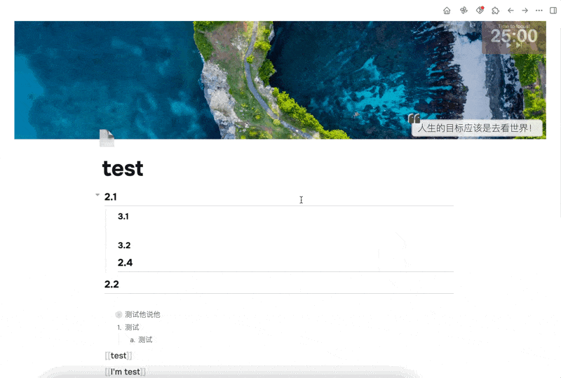
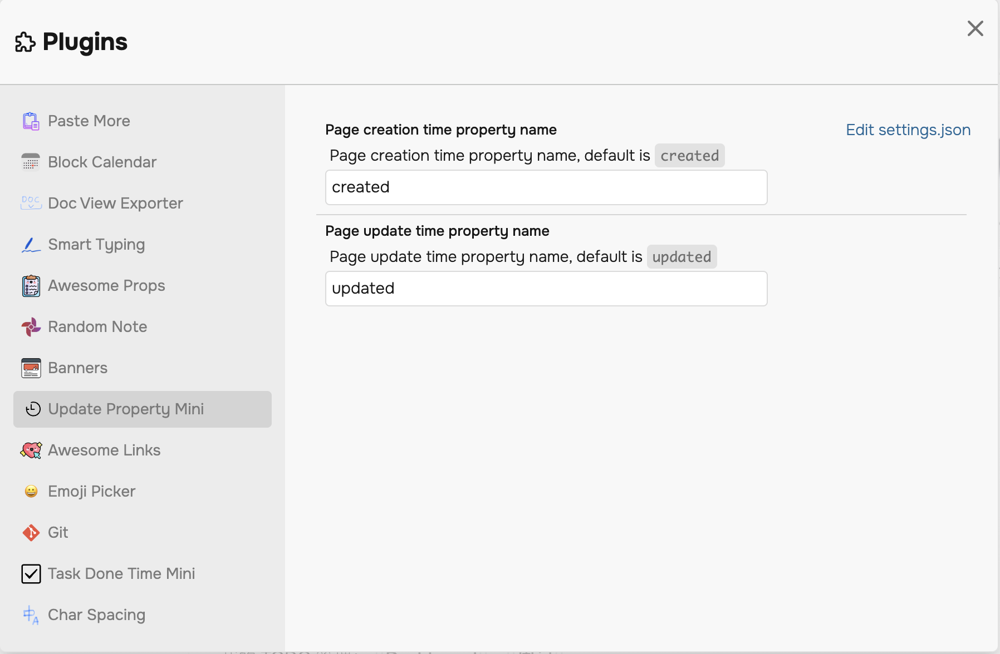

# Logseq Update Property Mini Plugin✔️

English | [中文](./README.md)

> Automatically add update and creation time (date, time, etc.) to your logseq pages

## Background

Although Logseq's pages have built-in creation and update time properties, they cannot be displayed.

I want to know when my page was updated and created. And in the Journey diary page, I want to display the articles that were updated and created on the current day.

## Features

> Note: The creation time property once created will not change, but the update time property will be updated as you update the page.

1. Automatically add update and creation time properties (default will not add these properties to the diary page) 🔨
2. You can choose what the property name is, the default is `updated` and `created` 📝
3. Enjoy! 🎉

## Demo

## About the configuration

Currently, only the property name can be modified.

