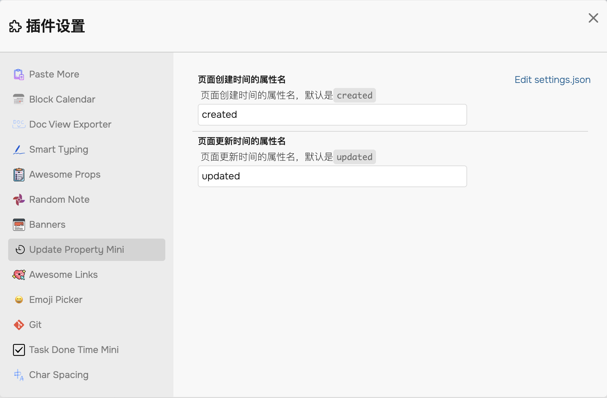

# Logseq Update Property Mini Plugin✔️

中文 | [English](./README.en.md)

> 给你的 logseq 页面自动添加更新时间和创建时间（日期、时间甚至更多.....）

## 背景

虽然 Logseq 的页面自带了创建时间和更新时间属性，但是不能显示出来。

我希望知道自己页面什么时间更新了，什么时间创建。并且在 Journey 日记页能够将当天更新和创建过的文章显示出来。

## 功能特点

> 注意：创建时间属性一但创建就不会更改，而更新时间属性会随着你更新页面而更新。

1. 自动添加更新时间和创建时间属性（默认不会给日记页面的更改添加这些属性） 🔨
2. 你可以选择属性名叫什么，默认是 `updated` 和 `created` 📝
3. Enjoy! 🎉

## 功能演示

## 关于配置项

暂时只能修改属性名。

